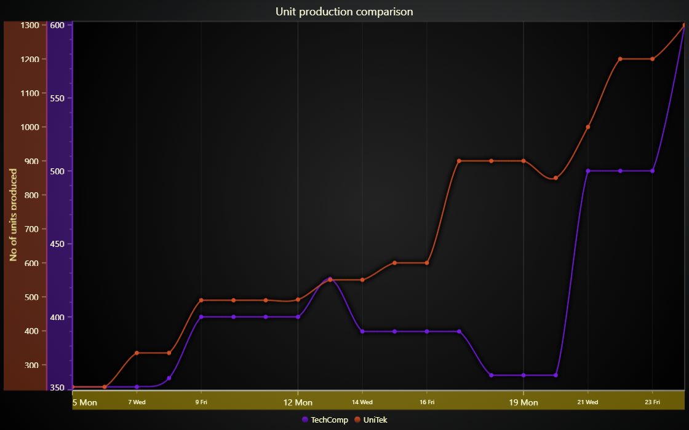

# Shared Axis



This demo application belongs to the set of examples for LightningChart JS, data visualization library for JavaScript.

LightningChart JS is entirely GPU accelerated and performance optimized charting library for presenting massive amounts of data. It offers an easy way of creating sophisticated and interactive charts and adding them to your website or web application.

The demo can be used as an example or a seed project. Local execution requires the following steps:

-   Make sure that relevant version of [Node.js](https://nodejs.org/en/download/) is installed
-   Open the project folder in a terminal:

          npm install              # fetches dependencies
          npm start                # builds an application and starts the development server

-   The application is available at _http://localhost:8080_ in your browser, webpack-dev-server provides hot reload functionality.


## Description

Best practice of data visualization within Data Analysis in different fields and industries is combining multiple series in one chart to examine and get richer insight about collected data. Moreover, it allows researchers to make conclusions about the researching phenomena out of each data set, to search patterns and relationships both within a collection and across collections

This example shows how to:

-   configure the axis styling;
-   create additional axes;
-   assign series to explicit axes;
-   styling of ChartXY zooming rectangle.

## Request default axes.

Cartesian XY charts contains default X and Y axes by default. To request the default axes of a chart, you can simply use:

```javascript
// Cache reference to default X-axis for further usage.
const axisXDefault = chart.getDefaultAxisX()

// Cache reference to default Y-axis for further usage.
const axisYDefault = chart.getDefaultAxisY()
```

During the creation of any XY series, you can attach series to default axes by not specifying the xAxis or yAxis options.

## Create new axis and attach series.

```javascript
// Create additional X-axis
const axisYNew = chart.addAxisX()

// Create additional Y-axis
const axisYNew = chart.addAxisY()
```

During the creation of any XY series, you can attach series to any axes via the cached references as the arguments.

```javascript
// Create series with explicit axes, share the same x-axis between two series.
const allSeries = [
    chart.addSplineSeries({
    xAxis: axisXDefault,
    yAxis: AxisYDefault
    }),
    chart.addSplineSeries({
    xAxis: axisXDefault,
    yAxis: axisYNew
    }),
    ...
]
```

## Axis styling.

Both X and Y axes share the same flexible and fully customizable API, meaning the same setters and getters. The full list of methods of the class **_Axis_** you can find in LightningChart JS API reference.

```javascript
// Add additional styling for the axis.
axis
    .setTitle( 'My axis' )
    // Configure axis line style.
    .setStrokeStyle( axisStrokeStyle )
    // Configure axis tick style by modifying the Axis TickStrategy.
    .setTickStrategy(
        // Use Numeric TickStrategy as Base.
        AxisTickStrategies.Numeric,
        // Use a mutator to modify the TickStrategy.
        ( tickStrategy ) => tickStrategy
            // Modify the Major Ticks for the TickStrategy.
            // Minor and Extreme TickStyles must be set separately.
            .setMajorTickStyle( visibleTicks => visibleTicks
                // Label fill Style.
                .setLabelFillStyle( axisLabelFillStyle )
                // Font.
                .setLabelFont( font => font
                    // Configure the font.
                    ...
                )
                // Grid stroke style
                .setGridStrokeStyle( gridStrokeStyle )
            )
    )
    // Configure axis overlay style (interactive axis area).
    .setOverlayStyle( axisFillStyleHighlight )
```


## API Links

* [XY cartesian chart]
* [Axis]
* [Spline series]
* [Color palettes]
* [RGBA color factory]
* [Solid FillStyle]
* [Solid LineStyle]
* [Auto cursor XY]


## Support

If you notice an error in the example code, please open an issue on [GitHub][0] repository of the entire example.

Official [API documentation][1] can be found on [LightningChart][2] website.

If the docs and other materials do not solve your problem as well as implementation help is needed, ask on [StackOverflow][3] (tagged lightningchart).

If you think you found a bug in the LightningChart JavaScript library, please contact sales@lightningchart.com.

Direct developer email support can be purchased through a [Support Plan][4] or by contacting sales@lightningchart.com.

[0]: https://github.com/Arction/
[1]: https://lightningchart.com/lightningchart-js-api-documentation/
[2]: https://lightningchart.com
[3]: https://stackoverflow.com/questions/tagged/lightningchart
[4]: https://lightningchart.com/support-services/

© LightningChart Ltd 2009-2022. All rights reserved.


[XY cartesian chart]: https://lightningchart.com/js-charts/api-documentation/v7.0.1/classes/ChartXY.html
[Axis]: https://lightningchart.com/js-charts/api-documentation/v7.0.1/classes/Axis.html
[Spline series]: https://lightningchart.com/js-charts/api-documentation/v7.0.1/classes/SplineSeries.html
[Color palettes]: https://lightningchart.com/js-charts/api-documentation/v7.0.1/variables/ColorPalettes.html
[RGBA color factory]: https://lightningchart.com/js-charts/api-documentation/v7.0.1/functions/ColorRGBA.html
[Solid FillStyle]: https://lightningchart.com/js-charts/api-documentation/v7.0.1/classes/SolidFill.html
[Solid LineStyle]: https://lightningchart.com/js-charts/api-documentation/v7.0.1/classes/SolidLine.html
[Auto cursor XY]: https://lightningchart.com/js-charts/api-documentation/v7.0.1/interfaces/AutoCursorXY.html

